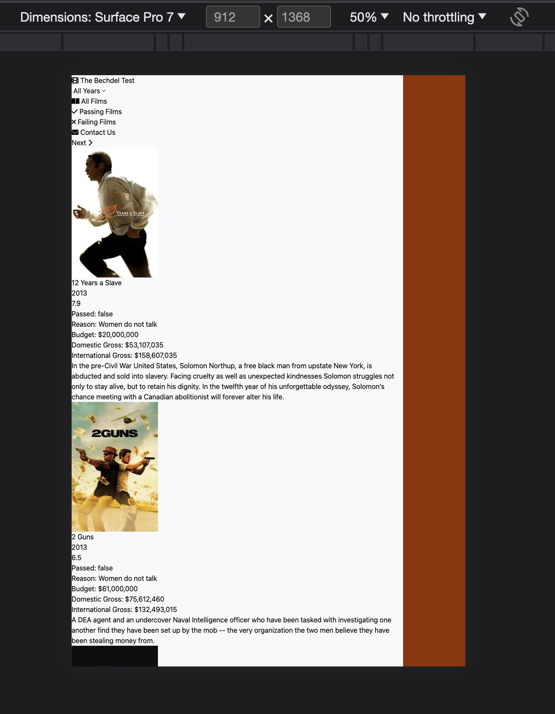

<!-- START doctoc generated TOC please keep comment here to allow auto update -->
<!-- DON'T EDIT THIS SECTION, INSTEAD RE-RUN doctoc TO UPDATE -->
**Table of Contents**  *generated with [DocToc](https://github.com/thlorenz/doctoc)*

- [Tailwind CSS Pluralsight](#tailwind-css-pluralsight)
  - [Intro](#intro)
    - [Demo](#demo)
  - [Using TailwindCSS](#using-tailwindcss)
    - [Building Your CSS](#building-your-css)
    - [Using Layers](#using-layers)
    - [Adding Reusable Classes](#adding-reusable-classes)
  - [TailwindCSS Styles](#tailwindcss-styles)
    - [Layout](#layout)
    - [Units](#units)
    - [Colors](#colors)
    - [Other Utility Classes](#other-utility-classes)
    - [Fonts](#fonts)
      - [Customize Theme](#customize-theme)
    - [States and Variants](#states-and-variants)
    - [Responsive Design](#responsive-design)
    - [Plugins](#plugins)
  - [TailwindCSS for Forms](#tailwindcss-for-forms)
    - [The Form](#the-form)
    - [Styling Inputs](#styling-inputs)
    - [Styling Buttons](#styling-buttons)

<!-- END doctoc generated TOC please keep comment here to allow auto update -->

# Tailwind CSS Pluralsight

My notes from Pluralsight course on [TailwindCSS Fundamentals](https://app.pluralsight.com/library/courses/tailwind-css-3-fundamentals/table-of-contents)

Running the exercises, from Module 3 onwards:

```bash
# terminal 1
cd module3
npm run dev

# terminal 2
cd module3/public
npx live-server
```

## Intro

CSS becomes difficult to maintain as project grows:
* writing css rules is time consuming
* difficult to debug css
* cascading rules hard to understand
* copy/pasting css around makes the problem worse
* selector syntax is hard to grasp

There are no best practices that work generally well:
* Semantic class names do not work
* Designing for re-use leads to dogma
* Block Element Modifiers are clumsy and hard to maintain
* CSS based on structure of web site leads to bloat, and eventually affects performance
* Separation of concerns is a red herring, keeping designs in a separate file isn't practical for a large project
* Component-based CSS is hard to manage

[CSS Utility Classes and Separation of Concerns](https://adamwathan.me/css-utility-classes-and-separation-of-concerns/)

Projects like Bootstrap, Bulma, Foundation can help with pre-built design esthetics.

Tailwind CSS is different: Utility class library

Course using TailwindCSS 3

Node???

**Utility Classes**

* Single-responsibility design classes, eg: showing a border, specifying the width or padding.
* End up with multiple classes that just change the design of a single part of the UI.
* Can design components with utility classes, speeds up development.
* Can still enable re-use, but only when you really need it (won't need it as often as you'd think)
* Better than inline styles, they promote consistency

**What is Tailwind CSS?**

Consists of:
* A set of known utility classes
* Efficient CSS build - only builds css that's actually needed for the project
* Extensible theming - can modify existing theme that comes with the utility classes or make your own from scratch

**Features**

* Consistent design system, eg: units
* Powerful API for extensibility and configuration: Tool to allow you to build your own design system, with sensible defaults.
* Eliminates unused CSS
* Responsive throughout - every element has its own notion of responsiveness
* States and variants (eg: hover, disabled, responsive breakpoints)
* Easy SPA integration

**What about component frameworks?**

Tailwind is *not* a component framework. It's a set of utility classes and a build system.

But if you're already using something like Bootstrap, Bulma, etc. these can co-exist with Tailwind, but there will be some work.

**Editor Integration**

Install extension for your editor - look for authored by: Tailwind Labs, [VS Marketplace](https://marketplace.visualstudio.com/items?itemName=bradlc.vscode-tailwindcss) - supports intellisense.

### Demo

Starting with app provided in course Exercise Files. Displays movie info. All movie data comes from API provided by instructor: https://bechdel.azurewebsites.net/api/films

Start with website not built with Tailwind:

```bash
cd module2/public
npx live-server
```

`css/site.css` has all the styles that have been built "by hand".

`index.html` links to the css in the `<head>...</head>` section:

```htm
<link rel="stylesheet" href="css/site.css" />
```

Original website looks like this:


Comment out the css from index, we'll rebuild it with Tailwind.

With no site.css, it looks like this:


Add link to tailwind from cdn in index header. Normally would use a build system but for quick demo here, will use cdn:

```htm
<!-- module2/public/index.html -->
<head>
    <meta charset="UTF-8" />
    <meta http-equiv="X-UA-Compatible" content="IE=edge" />
    <meta name="viewport" content="width=device-width, initial-scale=1.0" />

    <title>Bechdel Test</title>

    <!-- Comment out original css as we will rebuild this with Tailwind -->
    <!-- <link rel="stylesheet" href="css/site.css" /> -->
    <script src="https://cdn.tailwindcss.com"></script>

    <!-- Other stuff... -->
</head>
```

Site looks subtly different, just adding tailwind script has changed a few things:


Tailwind has removed default browser styling - css reset - start fresh. It also set a standard font (we could change that later).

Add utility class to body tag: (note: not yet getting intellisense support from vs code extension because haven't installed tailwind via package.json and don't yet have a tailwind config file)

```htm
<!-- bg: background -->
<!-- amber: one of the standard colors -->
<!-- 900: level of the color (from 50 - 900) -->
<body class="bg-amber-800">
```

Now website looks like this:


Look at this style in dev tools:

```css
.bg-amber-800 {
  --tw-bg-opacity: 1;
  background-color: rgb(146 64 14 / var(--tw-bg-opacity));
}
```

Update div just inside the body to tell it its a container, give it a gray background:

```htm
<body class="bg-amber-800">
  <div id="container" class="container bg-gray-50">
```

`container` class has responsive styling: 100% width on small screens, then varying sizes on larger screens, look at dev tools:

```css
@media (min-width: 1536px)
.container {
  max-width: 1536px;
}
```

Large:


Then use "toggle device" in Chrome dev tools to simulate small phone:

```css
.container {
  width: 100%;
}
```


Medium width (Surface Pro 7):

```css
@media (min-width: 768px)
.container {
  max-width: 768px;
}
```



But we want container centered, normally would write this css by hand such as:

```css
.container {
  margin: 0 auto;
}
```

To get this effect, use utility class starting with `m` for margin, `x` means set left and right (i.e. along the x-axis) (y for y-axis, b for bottom, t for top, l for left, r for right):

```htm
<body class="bg-amber-800">
  <div id="container" class="container bg-gray-50 mx-auto">
```

Here's how it looks now on a medium width screen:


Where tailwind css generated:

```css
.mx-auto {
  margin-left: auto;
  margin-right: auto;
}
```

Update the gray background on centered container to 100 for light, but 50 was too light:

```htm
<body class="bg-amber-800">
  <div id="container" class="container bg-gray-100 mx-auto">
```

Update site name to update site title styles.

`text-lg` would set the text to "large", `text-xl` - larger, `text-xs` - extra small. Goes up to 5xl.

```htm
<body class="bg-amber-800">
  <div id="container" class="container bg-gray-100 mx-auto">
    <header>
      <div id="site-name" class="text-2xl">
        <a href="/"><i class="fas fa-film"></i> The Bechdel Test</a>
      </div>
```

Also specify the font should be bold. Note we do not say `text-bold`, but `font-bold` because font weights are handled differently than the text.

Also specify text color with `text-amber-800`:

```htm
<div id="site-name" class="text-2xl font-bold text-amber-800">
```


Finally, add some padding around the title text with `p-4`:

(could also specify px for x-axis, pl for left, eg: `pl-4`, top, right bottom with t r b respectively).

```htm
<div id="site-name" class="text-2xl font-bold text-amber-800 p-4">
```

Generated styles for this element from dev tools:

```css
.text-amber-800 {
  --tw-text-opacity: 1;
  color: rgb(146 64 14 / var(--tw-text-opacity));
}

.font-bold {
  font-weight: 700;
}

.text-2xl {
  font-size: 1.5rem;
  line-height: 2rem;
}

.p-4 {
  padding: 1rem;
}
```

Can also specify no wrapping for whitespace, class name is very similar to css:

```htm
<div id="site-name" class="text-2xl font-bold text-amber-800 p-2 whitespace-nowrap">
```

## Using TailwindCSS

### Building Your CSS

* Start with a source file, eg: `style.src.css`
* "Something" scans for web content files for TailwindCSS classes (eg: html, js, ts,vue, etc)
* Then an output css file `styles.css` is built containing only the tailwind classes you're actually using, plus a css reset (built into library)

Add it to project, working with `module3`

Initialize project with a config file, from terminal:

```bash
cd module3
npx tailwindcss init
```

```
Need to install the following packages:
  tailwindcss@3.3.3
Ok to proceed? (y) y

Created Tailwind CSS config file: tailwind.config.js
```

Generated file:

```javascript
/** @type {import('tailwindcss').Config} */
module.exports = {
  content: [],
  theme: {
    extend: {},
  },
  plugins: [],
}
```

Update `content` array to tell Tailwind where to look to find css classes it needs to process:

```javascript
/** @type {import('tailwindcss').Config} */
module.exports = {
  content: [
    "./src/*.{html,js}",
    "./public/index.html"
  ],
  theme: {
    extend: {},
  },
  plugins: [],
}
```

Create new file - naming it `.src` because we won't be using this file directly in project, rather it will get generated.

Tailwind needs "directives" in this file so it knows where it should generate its css.

These are also called layers so Tailwind knows the order in which they should be constructed

```css
/* module3/src/app.src.css */
```

Back in terminal, use `-i` to specify input file and `-o` for output file, this tells tailwind to generate an output file from the given input:

```bash
npx tailwindcss -i ./src/app.src.css -o ./public/css/app.css
```

[Generated app.css](module3/public/css/app.css)

Bunch of reset css and variables defined at the top, towards the bottom, there are the classes we started using in `index.html`` from earlier course section:

```css
! tailwindcss v3.3.3 | MIT License | https://tailwindcss.com
*/

/*
1. Prevent padding and border from affecting element width. (https://github.com/mozdevs/cssremedy/issues/4)
2. Allow adding a border to an element by just adding a border-width. (https://github.com/tailwindcss/tailwindcss/pull/116)
*/

*,
::before,
::after {
  box-sizing: border-box;
  /* 1 */
  border-width: 0;
  /* 2 */
  border-style: solid;
  /* 2 */
  border-color: #e5e7eb;
  /* 2 */
}

::before,
::after {
  --tw-content: '';
}

/* other tailwind stuff... */

/* classes we specified in public/index.html */
.mx-auto {
  margin-left: auto;
  margin-right: auto;
}

.hidden {
  display: none;
}

.w-full {
  width: 100%;
}

.whitespace-nowrap {
  white-space: nowrap;
}

.bg-amber-800 {
  --tw-bg-opacity: 1;
  background-color: rgb(146 64 14 / var(--tw-bg-opacity));
}

.bg-gray-100 {
  --tw-bg-opacity: 1;
  background-color: rgb(243 244 246 / var(--tw-bg-opacity));
}

.p-2 {
  padding: 0.5rem;
}

.text-2xl {
  font-size: 1.5rem;
  line-height: 2rem;
}

.font-bold {
  font-weight: 700;
}

.text-amber-800 {
  --tw-text-opacity: 1;
  color: rgb(146 64 14 / var(--tw-text-opacity));
}
```

So the generated css file will be smaller than the entire tailwind library because it only includes the css classes that are needed in the project.

Now update `public/index.html` - remove the cdn script for tailwind and instead use a stylesheet link for our generated css:

```htm
<!-- module3/public/index.html -->
<!-- Using generated css from tailwind -->
<link rel="stylesheet" href="css/app.css">
```

Then view the project with:

```bash
cd module3/public
npx live-server
```

Now let's update the site name to be slightly ligher color:

```htm
<!-- BEFORE -->
<div id="site-name" class="text-2xl font-bold text-amber-800 p-2 whitespace-nowrap">
  <a href="/"><i class="fas fa-film"></i> The Bechdel Test</a>
</div>

<!-- AFTER -->
<div id="site-name" class="text-2xl font-bold text-amber-700 p-2 whitespace-nowrap">
  <a href="/"><i class="fas fa-film"></i> The Bechdel Test</a>
</div>
```

Now the title "The Bechdel Test" turns black (default color) because `text-amber-700` is not defined in the generated `css/app.css`. We need to run the tailwind command to generate it again:

```bash
npx tailwindcss -i ./src/app.src.css -o ./public/css/app.css
```

That will update the generated file to now have the 700 variant of amber text color rather than 800 we had before:

```css
/* module3/public/css/app.css */
.text-amber-700 {
  --tw-text-opacity: 1;
  color: rgb(180 83 9 / var(--tw-text-opacity));
}
```

But it's tedious to have to run this each time, use `-w` flag to leave it running watching for changes:

```bash
npx tailwindcss -i ./src/app.src.css -o ./public/css/app.css -w
```

Now as you make changes to `module3/public/index.html`, tailwind will watch it and auto re-generate `public/css/app.css`. This together with `live-server` will auto reload the page in the browser.

Now stop the tailwindcss watch command, and put it in package.json scripts, replace the sass command that was being used to build this site before:

```json
// module3/package.json
"dev:css": "npx tailwindcss -i ./src/app.src.css -o ./public/css/app.css -w",
```

Now run in terminal (from `module3` directory):

```bash
npm run dev:css
```

Even better, can simply do:

```bash
npm run dev
```

Because the `dev` script specifies "run everything that starts with `dev`, using `run-p` which means run all in parallel:

```json
// module3.package.json
{
  // ...
  "scripts": {
    "dev": "run-p dev:*",
    "dev-js": "rollup --config -w",
    "dev:css": "npx tailwindcss -i ./src/app.src.css -o ./public/css/app.css -w",
    "build": "run-p build-*",
    "build-js": "rollup --config rollup.config.prod.js",
    "build-css": "sass --style=compressed ./src/site.scss ./public/css/site.css"
  },
  // ...
}
```

For me fails: `sh: run-p: command not found`, need [npm-run-all](https://www.npmjs.com/package/npm-run-all):

```bash
npm install npm-run-all --save-dev
```

### Using Layers

Example, might want to use h1, h2 tags in various places, add one within header element:

```htm
<header>
  <h1>Testing H1 in Header</h1>
  <div id="site-name" class="text-2xl font-bold text-amber-300 p-2 whitespace-nowrap">
    <a href="/"><i class="fas fa-film"></i> The Bechdel Test</a>
  </div>
```

Renders very small relative to everything else:


It's small because tailwind automatically added a css reset.

We can add our own basic styles for some elements in `app/src/css`:

```css
/* module3/src/app.src.css */
@tailwind base;
@tailwind components;
@tailwind utilities;

h1 {
  font-weight: bold;
  font-size: 2rem;
}
```

Now header looks like this using our styles.


Could repeat the definitions for h2 through 4:

```css
/* module3/src/app.src.css */
@tailwind base;
@tailwind components;
@tailwind utilities;

h1 {
  font-weight: bold;
  font-size: 2rem;
}

h2 {
  font-weight: bold;
  font-size: 2rem;
}

h3 {
  font-weight: bold;
  font-size: 2rem;
}

h4 {
  font-weight: bold;
  font-size: 2rem;
}
```

Then check what tailwind generated, it just appended our header styles at the end:

```css
/* module3/public/css/app.css */

/* tailwind reset including headers */
/*
Remove the default font size and weight for headings.
*/

h1,
h2,
h3,
h4,
h5,
h6 {
  font-size: inherit;
  font-weight: inherit;
}

/* Our custom header styles */
h1 {
  font-weight: bold;
  font-size: 2rem;
}

h2 {
  font-weight: bold;
  font-size: 2rem;
}

h3 {
  font-weight: bold;
  font-size: 2rem;
}

h4 {
  font-weight: bold;
  font-size: 2rem;
}
```

But what we really want is to tell tailwind that these styles are part of the `base`, which allows us to *inject* these classes in the correct location within the css:

```css
/* module3/src/app.src.css */
@tailwind base;
@tailwind components;
@tailwind utilities;

@layer base {
  h1 {
    font-weight: bold;
    font-size: 2rem;
  }

  h2 {
    font-weight: bold;
    font-size: 1.5rem;
  }

  h3 {
    font-weight: bold;
    font-size: 1.2rem;
  }

  h4 {
    font-weight: bold;
    font-size: 1.1rem;
  }
}
```

Now the generated file has these in the middle, at the base section.

More explanation of `@layer` from Bing Chat:

The `@layer` directive is a custom Tailwind-specific at-rule that allows you to group your custom styles into one of three categories: `base`, `components`, and `utilities` ¹.

The `@layer` directive is used to tell Tailwind which "bucket" a set of custom styles belongs to ¹:

1. The `base` layer is used for styles that are applied to the base HTML elements, such as `h1`, `p`, and `a`.
2. The `components` layer is used for styles that are applied to reusable components, such as buttons, cards, and forms.
3. The `utilities` layer is used for styles that are applied to utility classes, such as `.text-red-500`, `.bg-gray-200`, and `.flex-row-reverse`.

Here's an example of how you can use the `@layer` directive in your CSS:

```
@tailwind base;
@tailwind components;
@tailwind utilities;

@layer base {
  h1 {
    @apply text-2xl;
  }
  h2 {
    @apply text-xl;
  }
}

@layer components {
  .btn-blue {
    @apply bg-blue-500 hover:bg-blue-700 text-white font-bold py-2 px-4 rounded;
  }
}

@layer utilities {
  .filter-none {
    filter: none;
  }
  .filter-grayscale {
    filter: grayscale(100%);
  }
}
```

Tailwind will automatically move the CSS within any `@layer` directive to the same place as the corresponding `@tailwind` rule, so you don't have to worry about authoring your CSS in a specific order to avoid specificity issues ¹. Any custom CSS added to a layer will only be included in the final build if that CSS is actually used in your HTML, just like all of the classes built into Tailwind by default ¹.

Source: Conversation with Bing, 8/28/2023
(1) Functions & Directives - Tailwind CSS. https://tailwindcss.com/docs/functions-and-directives.
(2) Using CSS Cascade Layers to Manage Custom Styles in a Tailwind Project. https://css-tricks.com/using-css-cascade-layers-to-manage-custom-styles-in-a-tailwind-project/.
(3) Functions & Directives - Tailwind CSS. https://v1.tailwindcss.com/docs/functions-and-directives.
(4) Adding Custom Styles - Tailwind CSS. https://tailwindcss.com/docs/adding-base-styles.

### Adding Reusable Classes

How to make use of this wrt tailwind classes?

`@apply` directive allows for re-use of tailwindcss classes in our custom definitions. i.e. we can use the same design language as tailwind, when developing our own custom styles.

Notice tailwindcss vscode extension intellisense:


```css
/* module3/src/app.src.css */
@tailwind base;
@tailwind components;
@tailwind utilities;

@layer base {
  h1 {
    @apply font-bold text-2xl;
  }

  h2 {
    @apply font-bold text-xl;
  }

  h3 {
    @apply font-bold text-lg;
  }

  h4 {
    @apply text-lg;
  }
}
```

Looking at what tailwind generated, let's focus on h1:

```css
/* module3/public/css/app.css */

/* ~line 91: reset */
/*
Remove the default font size and weight for headings.
*/

h1,
h2,
h3,
h4,
h5,
h6 {
  font-size: inherit;
  font-weight: inherit;
}

/* ~line 318: reset */
/*
Removes the default spacing and border for appropriate elements.
*/

blockquote,
dl,
dd,
h1,
h2,
h3,
h4,
h5,
h6,
hr,
figure,
p,
pre {
  margin: 0;
}

/* ~line 437: our custom base */
h1 {
  font-size: 1.5rem;
  line-height: 2rem;
  font-weight: 700;
}
```

Notice tailwind css class `text-2xl` translates to specifying both a line-height and font-size.

**When to use this technique of building custom classes vs simply using tailwind classes in html?** Should be the exception, not the rule.

If using framework like React, Vue, etc - tailwind creator suggests building a component (eg: button) in those tools rather than using apply.

## TailwindCSS Styles

Continue with code examples in `module3`.

### Layout

For example, can add inline-block to h1:

```htm
<h1 class="inline-block">Testing H1 in Header</h1>
```

Could add any "flex-..." or "grid..." class, eg:


Now would like to improve display of header and main section:


Add a new div to wrap header and main section, then add class flex:


Now sections are in flex container displayed in columns:


Tailwind added:

```css
.flex {
  display: flex;
}
```

To get more space between columns, use `gap-{n}` classes (works with both flex and grid).


For example, use `gap-1`:

```htm
<div class="flex gap-1">
  <header>...</header>
  <section>...</section>
</div>
```

Adds a row-gap and column-gap of 0.25rem

```css
.gap-1 {
  gap: 0.25rem;
}

.flex {
  display: flex;
}
```

Can see a small space between the columns now:


Now let's work on main section that displays all the movies. Has a div that displays the results, where each child has a class of film currently. Want to get the films laid out in a grid. Use `grid` class, together with helpers to define how many columns, in this case `grid-cols-2`:


Tailwind adds:

```css
.grid-cols-2 {
  grid-template-columns: repeat(2, minmax(0, 1fr));
}

.grid {
  display: grid;
}
```

Now movies display in a two column grid:


Easy enough to change it to `grid-cols-5` to increase number of columns from 2 to 5. Can also use `gap-{n}` to space things out:

```htm
<div id="results" class="grid grid-cols-5 gap-2">
```


Now leave it at three columns with no gap:

```htm
<div id="results" class="grid grid-cols-3">
```

Note that since the grid classes are defined on the parent element, could have JavaScript swap out the child elements (eg: select a different year for movies), and the grid layout is still maintained.

### Units

Tailwind "arithmetic":

1 Tailwind unit = 0.25rem
1 rem = 16px (i.e. base font size, but user can customize this in their browser, then all elements styled with rem units will scale proportionally)

So if user has not customized base font size, generally:
1 Tailwind unit = 0.25rem = 4px

Tailwind is consistent with units, eg: `gap-1` is 0.25rem (aka 4px).

Anytime there's a dash followed by a number, there's going to be consistent units

Frequently used are padding `p-{n}` and margin `m-{n}`.

`m1` and `p1` are `margin: 0.25rem;` and `padding: 0.25rem;` respectively.

Width `w-{n}` and `h-{n}` works the same way, eg: `w-1` is `width: 0.25rem;` and `h-1` is `height: 0.25rem;`

Available numbers are 0 - 12, then it starts skipping some numbers:


Largest available number is `m-96` (24rem, 384px, given a root font size of 16px).

Units are 1/4 rem per number. i.e. 96/4 = 24.

Padding and margin also support cardinal directions.

Eg `pl-1` generates `padding-left: 0.25rem;`, `pr-1` is for padding-right, `pt-1` for padding-top, and `pb-1` for padding-bottom.

Also have `px-1`, which generates: (i.e. control the x-axis)

```css
.px-1 {
  padding-left: 0.25rem;
  padding-right: 0.25rem;
}
```

and `py-1`, which generates: (i.e. control the y-axis)

```css
.py-1 {
  padding-top: 0.25rem;
  padding-bottom: 0.25rem;
}
```

Margin has the same x/y variations.

Update `<header>` element to have `p-2`, i.e. `padding: 0.5rem` (8px given 16px root font size), space it out so its not right up at top right corner of container:

```htm
<header class="p-2">
  <!-- ... -->
</header>
```


If you want the top padding to be a different value than the rest, first specify top padding value, then the rest. IMPORTANT: first the top value that should be different, then the rst:

```htm
<header class="pt-1 p-2">
  <!-- ... -->
</header>
```

Generates:

```css
.pt-1 {
  padding-top: 0.25rem;
}

.p-2 {
  padding: 0.5rem;
}
```

Expanding the `padding` in dev tools, can see that the padding-top is overridden by earlier definition of pt-1:


More common would be to specify x and y (i.e. consisting padding for left and right, and consistent padding for top and bottom):

```htm
<header class="py-1 px-2">
  <!-- ... -->
</header>
```

Generates:

```css
.py-1 {
  padding-top: 0.25rem;
  padding-bottom: 0.25rem;
}

.px-2 {
  padding-left: 0.5rem;
  padding-right: 0.5rem;
}
```

Recall the Tailwind config is also looking at JavaScript files (configured in `content` section):

```javascript
// module3/tailwind.config.js
/** @type {import('tailwindcss').Config} */
module.exports = {
  content: [
    "./src/*.{html,js}",
    "./public/index.html"
  ],
  theme: {
    extend: {},
  },
  plugins: [],
}
```

Looking at `results.js` (already provided by instructor as part of exercise files), it has a template that outputs html for each film:

```javascript
// module3/src/results.js
// ...
function formatFilm(film) {
  return `<div class="film">
    
    <div class="title">${film.title}</div>
    <div class="info">${film.year}</div>
    <div class="info">${film.rating}</div>
    <div class="info">Passed: ${film.passed}</div>
    <div class="info">Reason: ${film.reason}</div>
    <div class="info">Budget: $${film.budget.toLocaleString("en-US")}</div>
    <div class="info">Domestic Gross: $${film.domesticGross.toLocaleString(
      "en-US"
    )}</div>
    <div class="info">International Gross: $${film.internationalGross.toLocaleString(
      "en-US"
    )}</div>
    <p>${film.overview}</p>
  </div>`;
}
```

This markup can also be edited to use TailwindCSS classes, and the Tailwind build will generate corresponding css.

Eg: Remove the `film` class from old sass build, replace with `h-72` for a height of 72 * 0.25 = 18rem;

```javascript
// module3/src/results.js
// ...
function formatFilm(film) {
  return `<div class="h-72">`
  // ...
}
```

Other height options are `h-full` for full height (relative to its parent element), generates:

```css
.h-full {
  height: 100%;
}
```

`h-screen` for full viewport height, generates:

```css
.h-screen {
  height: 100vh;
}
```

vh units: Viewport height - relative unit that represents percentage of viewport's height, so 100vh is full height of user's viewport.

Also have `min-h-screen` which generates:

```css
.min-h-screen {
  min-height: 100vh;
}
```

This ensures element takes up at least the full height of the viewport, but can also expand further if content inside the element requires more space.

Add wrapper div around image to make it quite large, then wrap all the other information so it can appear to the right of the image.

Note use of `flex-none` and `relative` (`absolute` is also available), `overflow-hidden`:

```javascript
// module3/src/results.js
function formatFilm(film) {
  return `<div class="h-72 overflow-hidden">
    <div class="w-48 flex-none relative">
      
    </div>
    <div class="ml-48 p-2">
      <div class="title">${film.title}</div>
      <div class="info">${film.year}</div>
      <div class="info">${film.rating}</div>
      <div class="info">Passed: ${film.passed}</div>
      <div class="info">Reason: ${film.reason}</div>
      <div class="info">Budget: $${film.budget.toLocaleString("en-US")}</div>
      <div class="info">Domestic Gross: $${film.domesticGross.toLocaleString(
        "en-US"
      )}</div>
      <div class="info">International Gross: $${film.internationalGross.toLocaleString(
        "en-US"
      )}</div>
      <p>${film.overview}</p>
    </div>
  </div>`;
}
```

### Colors

Update header to have a different color.

Tailwind ships with a standard set of colors that appear consistently across classes, eg: amber, blue, grey, stone, slate, etc.


Each number has a variation for depth of that color, eg: text-slate-50, text-slate-100, ...text-slate-900:


(later will learn how to specify our own colors)

Example: `text-slate-300` would generate:

```css
.text-slate-300 {
  --tw-text-opacity: 1;
  color: rgb(203 213 225 / var(--tw-text-opacity));
}
```

Note that white and black don't have have depth variations, so it would just be `class="text-white"` or `class="text-black"`, going with text-white for header:

```htm
<!-- module3/public/index.html -->
<body class="bg-amber-800">
    <div id="container" class="container bg-gray-100 mx-auto">
      <div class="flex gap-1">
        <header class="py-1 px-2 text-white">
          <div id="site-name" class="text-2xl font-bold text-amber-300 p-2 whitespace-nowrap">
            <a href="/"><i class="fas fa-film"></i> The Bechdel Test</a>
          </div>
          <section id="menu">
```

Generates:

```css
.text-white {
  --tw-text-opacity: 1;
  color: rgb(255 255 255 / var(--tw-text-opacity));
}
```

We can also set the background color (need contrast for the white text), example: bg-amber-400 (to distinguish from existing background bg-amber-800 on body element):

```htm
<!-- module3/public/index.html -->
<body class="bg-amber-800">
    <div id="container" class="container bg-gray-100 mx-auto">
      <div class="flex gap-1">
        <header class="py-1 px-2 text-white bg-amber-400">
          <div id="site-name" class="text-2xl font-bold text-amber-800 p-2 whitespace-nowrap">
            <a href="/"><i class="fas fa-film"></i> The Bechdel Test</a>
          </div>
          <section id="menu">
```

Can start to see distinguishing of sections based on different background colors


Adjust header text to dark grey so its easier to read against amber background:

```htm
<body class="bg-amber-800">
    <div id="container" class="container bg-gray-100 mx-auto">
      <div class="flex gap-1">
        <header class="py-1 px-2 text-gray-600 bg-amber-400">
          <div id="site-name" class="text-2xl font-bold text-amber-800 p-2 whitespace-nowrap">
            <a href="/"><i class="fas fa-film"></i> The Bechdel Test</a>
          </div>
          <section id="menu">
```


Background cover: `bg-cover` together with inline style for background-image. If only need something once, not worth making a custom class for it:

```htm
<!-- module3/public/index.html -->
<section id="main" class="bg-cover" style="background-image: url(img/bg-seats.jpg);">
```

Generates:

```css
element.style {
  background-image: url(img/bg-seats.jpg);
}

.bg-cover {
  background-size: cover;
}
```


But having background image makes movie text descriptions harder to read. Fix this in results javascript that renders template for each movie. Add light grey background `bg-gray-100` for each movie section, but use `/` syntax to specify some percent of transparency so that the background image will still show through:


```javascript
function formatFilm(film) {
  return `<div class="h-72 overflow-hidden bg-gray-100/70">
  ...
}
```

Generates:

```css
.bg-gray-100\/70 {
  rgb(243 244 246 / 0.7);
}
```


Now the background image of movie seats shows through enough to give an idea of a movie website, but it doesn't get in the way of reading the text of movie descriptions.

### Other Utility Classes

Some odds and ends that don't fit well into any other section.

Eg: Add `rounded` to each movie result:

```javascript
// module3/src/results.js
function formatFilm(film) {
  return `<div class="h-72 overflow-hidden bg-gray-100/50 rounded">
    <div class="w-48 flex-none relative">
      
    </div>
    <div class="ml-48 p-2">
      <div class="title">${film.title}</div>
      <div class="info">${film.year}</div>
      <div class="info">${film.rating}</div>
      <div class="info">Passed: ${film.passed}</div>
      <div class="info">Reason: ${film.reason}</div>
      <div class="info">Budget: $${film.budget.toLocaleString("en-US")}</div>
      <div class="info">Domestic Gross: $${film.domesticGross.toLocaleString(
        "en-US"
      )}</div>
      <div class="info">International Gross: $${film.internationalGross.toLocaleString(
        "en-US"
      )}</div>
      <p>${film.overview}</p>
    </div>
  </div>`;
}
```

Rounded variation, eg: `rounded-t` to only round the top


Using just `rounded` generates:

```css
.rounded {
  border-radius: 0.25rem;
}
```

Let's use `rounded-lg` for more of an effect. Generates:

```css
.rounded-lg {
  border-radius: 0.5rem;
}
```

Add some margin around each film to space out with `m-1`:

```javascript
// module3/src/results.js
function formatFilm(film) {
  return `<div class="h-72 overflow-hidden bg-gray-100/50 rounded-lg m-1">
    <div class="w-48 flex-none relative">
      
    </div>
    ...
}
```

Still needs some work but its taking shape:


Now work on styling text within each movie section.

Add `text-2xl` to movie title:

```javascript
// module3/src/results.js
function formatFilm(film) {
  return `<div class="h-72 overflow-hidden bg-gray-100/50 rounded-lg m-1">
    <div class="w-48 flex-none relative">
      
    </div>
    <div class="ml-48 p-2">
      <div class="text-2xl">${film.title}</div>
      ...
}
```

Generates:

```css
.text-2xl {
  font-size: 1.5rem;
  line-height: 2rem;
}
```

Which is a little big, makes some titles wrap. Instead use `text-xl` and `font-bold` for emphasis:

```javascript
// module3/src/results.js
function formatFilm(film) {
  return `<div class="h-72 overflow-hidden bg-gray-100/50 rounded-lg m-1">
    <div class="w-48 flex-none relative">
      
    </div>
    <div class="ml-48 p-2">
      <div class="text-xl font-bold">${film.title}</div>
      ...
}
```

Then get rid of all the old `class="info"` and replace with spans wrapping each label to style each individual label part of the film. Also use `w-24` to ensure the span wrapping the label will be at a fixed size. But also need to add `inline-block` for width to take effect on inline element:

```javascript
function formatFilm(film) {
  return `<div class="h-72 overflow-hidden bg-gray-100/50 rounded-lg m-1">
    <div class="w-48 flex-none relative">
      
    </div>
    <div class="ml-48 p-2">
      <div class="text-xl font-bold">${film.title}</div>
      <div><span class="font-bold w-24 inline-block">Year:</span>${film.year}</div>
      <div><span class="font-bold w-24 inline-block">Rating:</span>${film.rating}</div>
      <div><span class="font-bold w-24 inline-block">Passed:</span>${film.passed}</div>
      <div><span class="font-bold w-24 inline-block">Reason:</span>${film.reason}</div>
      <div><span class="font-bold w-24 inline-block">Budget:</span>$${film.budget.toLocaleString("en-US")}</div>
      <div><span class="font-bold w-24 inline-block">Dom. Gross:</span>$${film.domesticGross.toLocaleString(
        "en-US"
      )}</div>
      <div><span class="font-bold w-24 inline-block">Int'l Gross:</span>$${film.internationalGross.toLocaleString(
        "en-US"
      )}</div>
      <p>${film.overview}</p>
    </div>
  </div>`;
}
```

See how this makes the label and value pairs line up:


### Fonts

If we don't specify any font explicitly, the default font family provided by TailwindCSS is `font-sans`:

```css
html {
  font-family: ui-sans-serif, system-ui, -apple-system, BlinkMacSystemFont, "Segoe UI", Roboto, "Helvetica Neue", Arial, "Noto Sans", sans-serif, "Apple Color Emoji", "Segoe UI Emoji", "Segoe UI Symbol", "Noto Color Emoji";
}
```

Font classes provided by Tailwind include:


Let's update film title to `font-serif`:

```javascript
function formatFilm(film) {
  return `<div class="h-72 overflow-hidden bg-gray-100/50 rounded-lg m-1">
    <div class="w-48 flex-none relative">
      
    </div>
    <div class="ml-48 p-2">
      <div class="text-xl font-bold font-serif">${film.title}</div>
    ...
}
```

Generates:

```css
.font-serif {
  font-family: ui-serif, Georgia, Cambria, "Times New Roman", Times, serif;
}
```

Can see the title is now a serif font:


#### Customize Theme

Change to use [Roboto](https://fonts.google.com/specimen/Roboto) from Google Fonts. Add it to our css source:

```css
/* module3/src/app.src.css */
@import url("https://fonts.googleapis.com/css2?family=Roboto:wght@100;400;700&display=swap");
```

This just makes it available, but it won't show up in the styles yet.

To do this, need to customize the Tailwind theme in `tailwind.config.js`.

`theme` is to define your own (will do later). `extend` is to simply override some of the values from the built-in theme. This is where we'll specify our custom font.

So we're telling Tailwind that the `sans` font family should first use Roboto, then spread the default theme's font family sans definitions. This means we need to require the default theme:

```javascript
// module3/tailwind.config.js
const defaultTheme = require("tailwindcss/defaultTheme")

/** @type {import('tailwindcss').Config} */
module.exports = {
  content: [
    "./src/*.{html,js}",
    "./public/index.html"
  ],
  theme: {
    extend: {
      fontFamily: {
        sans: ["Roboto", ...defaultTheme.fontFamily.sans]
      }
    },
  },
  plugins: [],
}
```

At this point, the `npm run dev` build will fail because it can't find tailwindcss/defaultTheme:

```
Rebuilding...
Error: Cannot find module 'tailwindcss/defaultTheme'
Require stack:
- /Users/dbaron/projects/courses/tailwind-css-pluralsight/module3/tailwind.config.js
    at Module._resolveFilename (node:internal/modules/cjs/loader:1077:15)
    at Function.resolve (node:internal/modules/cjs/helpers:127:19)
    at _resolve (/Users/dbaron/.npm/_npx/bc7494899bbce1ca/node_modules/jiti/dist/jiti.js:1:250196)
    at jiti (/Users/dbaron/.npm/_npx/bc7494899bbce1ca/node_modules/jiti/dist/jiti.js:1:252505)
    at /Users/dbaron/projects/courses/tailwind-css-pluralsight/module3/tailwind.config.js:1:97
    at evalModule (/Users/dbaron/.npm/_npx/bc7494899bbce1ca/node_modules/jiti/dist/jiti.js:1:255202)
    at jiti (/Users/dbaron/.npm/_npx/bc7494899bbce1ca/node_modules/jiti/dist/jiti.js:1:253130)
    at /Users/dbaron/.npm/_npx/bc7494899bbce1ca/node_modules/tailwindcss/lib/lib/load-config.js:37:30
    at loadConfig (/Users/dbaron/.npm/_npx/bc7494899bbce1ca/node_modules/tailwindcss/lib/lib/load-config.js:39:6)
    at Object.loadConfig (/Users/dbaron/.npm/_npx/bc7494899bbce1ca/node_modules/tailwindcss/lib/cli/build/plugin.js:135:49) {
  code: 'MODULE_NOT_FOUND',
  requireStack: [
    '/Users/dbaron/projects/courses/tailwind-css-pluralsight/module3/tailwind.config.js'
  ]
}
```

Issue is up to this point, we've been using npx and haven't actually installed tailwind into the project package.json. Recall currently package.json in module3 has:

```json
"dev:css": "npx tailwindcss -i ./src/app.src.css -o ./public/css/app.css -w",
```

Fix by installing it and saving to project dev dependencies:

```bash
cd module3
npm i tailwindcss -D
```

This adds to package.json:

```json
"tailwindcss": "^3.3.3"
```

Now can update the run script to use tailwind directly rather than via npx:

```json
"dev:css": "tailwindcss -i ./src/app.src.css -o ./public/css/app.css -w",
```

Run it again - should work this time:

```bash
npm run dev
```

Now Roboto gets added to the generated css, in html font-family definition:

```css
/* module3/public/css/app.css */
@import url("https://fonts.googleapis.com/css2?family=Roboto:wght@100;400;700&display=swap");

/* ... */

html {
  line-height: 1.5;
  /* 1 */
  -webkit-text-size-adjust: 100%;
  /* 2 */
  -moz-tab-size: 4;
  /* 3 */
  -o-tab-size: 4;
     tab-size: 4;
  /* 3 */
  font-family: Roboto, ui-sans-serif, system-ui, -apple-system, BlinkMacSystemFont, "Segoe UI", Roboto, "Helvetica Neue", Arial, "Noto Sans", sans-serif, "Apple Color Emoji", "Segoe UI Emoji", "Segoe UI Symbol", "Noto Color Emoji";
  /* 4 */
  font-feature-settings: normal;
  /* 5 */
  font-variation-settings: normal;
  /* 6 */
}

/* ... */
```

And all the fonts on our site that were using default `sans` are now Roboto.

Note there is an easier way to use a custom font without going through all the trouble of customizing theme:

Could also have just specified it in base layer in app css src:

```css
/* module3/src/app.src.css */
@import url("https://fonts.googleapis.com/css2?family=Roboto:wght@100;400;700&display=swap");

@tailwind base;
@tailwind components;
@tailwind utilities;

@layer base {
  body {
    font-family: Roboto;
  }
  h1 {
    @apply font-bold text-2xl;
  }

  h2 {
    @apply font-bold text-xl;
  }

  h3 {
    @apply font-bold text-lg;
  }

  h4 {
    @apply text-lg;
  }
}
```

### States and Variants

Use different classes when things are in a certain state, eg: hover

Eg: each movie result currently has a semi-transparent gray background: `bg-gray-100/50`. Now want to remove the transparency if a user is hovering over a result.

Use `hover:` variants, eg: `hover:bg-gray-100`

```javascript
function formatFilm(film) {
  return `<div class="h-72 overflow-hidden bg-gray-100/50 hover:bg-gray-100 rounded-lg m-1">
    <div class="w-48 flex-none relative">
      
    </div>
    ...
  </div>`;
}
```

Generates:

```css
.hover\:bg-gray-100:hover {
  --tw-bg-opacity: 1;
  background-color: rgb(243 244 246 / var(--tw-bg-opacity));
}

.bg-gray-100\/50 {
  background-color: rgb(243 244 246 / 0.5)
}
```

Can use multiple `hover:...` variations on a single element. For example, to also change the text from white to black on hover:

```javascript
function formatFilm(film) {
  return `<div class="h-72 overflow-hidden bg-gray-100/50 hover:bg-gray-100 text-white hover:text-black rounded-lg m-1">
    <div class="w-48 flex-none relative">
      
    </div>
    ...
  </div>`;
}
```


Can use `hover:...` on any utility class.

Another state Tailwind provides is `dark:`, i.e. dark theme

Generally Tailwind will use theme from operating system setting.

For example, to specify: If user has a dark theme set on their machine, then set movie results to have a dark grey background with white text:

```javascript
function formatFilm(film) {
  return `<div class="h-72 overflow-hidden bg-gray-100/50 hover:bg-gray-100 rounded-lg m-1 dark:bg-gray-600/50 dark:text-white">
    <div class="w-48 flex-none relative">
      
    </div>
    ...
  </div>`;
}
```


To allow user to switch this, index.html has a button to toggle dark mode, its been hidden up until now to avoid confusion with inline style to display none, but let's use it now:

```htm
<!-- module3/public/index.html -->
<button id="toggle-dark" class="button w-full"">
  <i class="fas fa-eye"></i> Toggle Dark Mode
</button>
```

Then need to configure Tailwind. The default (which you don't have to specify) is:

```javascript
// read theme from operating system
darkMode: "prefers-color-scheme",
```

To support user being able to toggle on the website, regardless of their OS setting, change darkMode to `class`:

```javascript
// module3/tailwind.config.js
const defaultTheme = require("tailwindcss/defaultTheme")

/** @type {import('tailwindcss').Config} */
module.exports = {
  darkMode: "class",
  content: [
    "./src/*.{html,js}",
    "./public/index.html"
  ],
  theme: {
    extend: {
      fontFamily: {
        sans: ["Roboto", ...defaultTheme.fontFamily.sans]
      }
    },
  },
  plugins: [],
}
```

This means we can specify a class on `<body>` element in html to indicate if its dark mode. By default, it will be light.

Making above change (darkMode: "class"), now the `dark:...` styles are ignored because its defaulting to light, because we haven't modified the body element yet.

Add `dark` to body:

```htm
<!-- module3/public/index.html -->
<body class="bg-amber-800 dark">
  ...
</body>
```

And now the `dark:...` styles are rendered.

Generates `:is(...)` styles in css, eg:

```css
:is(.dark .dark\:bg-gray-600\/50){
  background-color: rgb(75 85 99 / 0.5);
}

:is(.dark .dark\:text-white){
  --tw-text-opacity: 1;
  color: rgb(255 255 255 / var(--tw-text-opacity));
}
```

Now we can use JavaScript in project (already provided by instructor). The "Toggle Dark Mode" button simply adds/removes the "dark" class from the body element.

```javascript
// module3/src/menu.js
const darkMenu = document.getElementById("toggle-dark");

export default function () {
  darkMenu.addEventListener("click", async () => {
    const body = document.body.classList.toggle("dark");
  });
}
```

Notes from ChatGPT about `:is` css selector:

The `:is` selector, also known as the `:matches` selector, allows you to target elements that match any of the provided selectors within the parentheses. It's particularly useful when you have multiple similar selectors that you want to apply the same styles to. It can improve code readability and reduce redundancy.

In your provided code, the `:is(.dark .dark\:bg-gray-600\/50)` selector targets elements that have both the `dark` class and the `dark:bg-gray-600/50` class. Similarly, the `:is(.dark .dark\:text-white)` selector targets elements with both the `dark` class and the `dark:text-white` class.

Here's a breakdown of your example:

1. `:is(.dark .dark\:bg-gray-600\/50)`:
   - Targets elements with the class `dark` and the class `dark:bg-gray-600/50`.
   - The `dark:bg-gray-600/50` class seems to be using Tailwind CSS's syntax for modifying classes within specific themes, in this case, the `dark` theme. It sets the background color to a semi-transparent gray (rgb(75 85 99 / 0.5)).

2. `:is(.dark .dark\:text-white)`:
   - Targets elements with the class `dark` and the class `dark:text-white`.
   - The `dark:text-white` class also seems to be using Tailwind CSS's syntax for theme modification. It sets the text color to white with an opacity defined by `--tw-text-opacity`.

It's worth noting that while `:is` is part of the CSS Selectors Level 4 specification, it might not be fully supported in all browsers, especially older ones. However, it's generally safe to use when building applications that target modern browsers or when using tools like Tailwind CSS that handle compatibility issues for you. If broad compatibility is a concern, you might want to check the current browser support for the `:is` selector.

Also, [MDN Ref on :is](https://developer.mozilla.org/en-US/docs/Web/CSS/:is)

Now let's add a new layer, using `ring` class which adds box shadow:

```css
/* module3/src/app.src.css */
@import url("https://fonts.googleapis.com/css2?family=Roboto:wght@100;400;700&display=swap");

@tailwind base;
@tailwind components;
@tailwind utilities;

@layer base {
  h1 {
    @apply font-bold text-2xl;
  }

  h2 {
    @apply font-bold text-xl;
  }

  h3 {
    @apply font-bold text-lg;
  }

  h4 {
    @apply text-lg;
  }
}

/* === NEW === */
@layer utilities {
  .wrapper {
    @apply ring ring-yellow-200 font-bold;
  }
}
```

Now let's use `wrapper` class in the "Toggle Dark Mode" button:

```htm
<!-- module3/public/index.html -->
<button id="toggle-dark" class="button w-full wrapper">
  <i class="fas fa-eye"></i> Toggle Dark Mode
</button>
```

Generates:

```css
/* module3/public/css/app.css */
.wrapper{
  font-weight: 700;
  --tw-ring-offset-shadow: var(--tw-ring-inset) 0 0 0 var(--tw-ring-offset-width) var(--tw-ring-offset-color);
  --tw-ring-shadow: var(--tw-ring-inset) 0 0 0 calc(3px + var(--tw-ring-offset-width)) var(--tw-ring-color);
  box-shadow: var(--tw-ring-offset-shadow), var(--tw-ring-shadow), var(--tw-shadow, 0 0 #0000);
  --tw-ring-opacity: 1;
  --tw-ring-color: rgb(254 240 138 / var(--tw-ring-opacity));
}
```

Can see the button now has a bright yellow outline around it and the text is bold:


Interesting we can add the hover effect also to our custom utility classes like `wrapper`, eg:

```htm
<button id="toggle-dark" class="button w-full hover:wrapper">
  <i class="fas fa-eye"></i> Toggle Dark Mode
</button>
```

Generates:

```css
.wrapper{
  font-weight: 700;
  --tw-ring-offset-shadow: var(--tw-ring-inset) 0 0 0 var(--tw-ring-offset-width) var(--tw-ring-offset-color);
  --tw-ring-shadow: var(--tw-ring-inset) 0 0 0 calc(3px + var(--tw-ring-offset-width)) var(--tw-ring-color);
  box-shadow: var(--tw-ring-offset-shadow), var(--tw-ring-shadow), var(--tw-shadow, 0 0 #0000);
  --tw-ring-opacity: 1;
  --tw-ring-color: rgb(254 240 138 / var(--tw-ring-opacity));
}

.hover\:bg-gray-100:hover{
  --tw-bg-opacity: 1;
  background-color: rgb(243 244 246 / var(--tw-bg-opacity));
}

.hover\:wrapper:hover{
  font-weight: 700;
  --tw-ring-offset-shadow: var(--tw-ring-inset) 0 0 0 var(--tw-ring-offset-width) var(--tw-ring-offset-color);
  --tw-ring-shadow: var(--tw-ring-inset) 0 0 0 calc(3px + var(--tw-ring-offset-width)) var(--tw-ring-color);
  box-shadow: var(--tw-ring-offset-shadow), var(--tw-ring-shadow), var(--tw-shadow, 0 0 #0000);
  --tw-ring-opacity: 1;
  --tw-ring-color: rgb(254 240 138 / var(--tw-ring-opacity));
}
```

Now the yellow outline around toggle button only shows up when hovering over it.

Adding `hover:...` to a custom class works as long as that class is in one of base, components, or utilities in `app.src.css`.

### Responsive Design

For remainder, remove `dark` from `<body>` element, no longer using it.

Responsive design in Tailwind provides 5 breakpoints.

Currently the grid of movie results always displays across 3 columns:

```htm
<!-- module3/public/index.html -->
<div id="results" class="grid grid-cols-3">
  ...
</div>
```

Which generates:

```css
/* module3/public/css/app.css */
.grid{
  display: grid;
}

.grid-cols-3{
  grid-template-columns: repeat(3, minmax(0, 1fr));
}
```

TailwindCSS is mobile-first so the first value specified will be used on the smallest screen, then can specify more values for larger screens.

Example, change to one column for movie results:

```htm
<!-- module3/public/index.html -->
<div id="results" class="grid grid-cols-1">
  ...
</div>
```

Which generates:

```css
/* module3/public/css/app.css */
.grid{
  display: grid;
}

.grid-cols-1{
  grid-template-columns: repeat(1, minmax(0, 1fr));
}
```


On a small screen, this looks about right, except might want to change placement of menu and results so they're not side-by-side because its too crowded on a small screen:


Solution is to use variant for different sizes.

`xs` is smallest screen size and is the default so there is no variant for it. xs === mobile phone.

Other screen sizes are:

1. `sm`: small
2. `md`: medium
3. `lg`: large
4. `xl`: extra large
5. `2xl`: extra extra large

Update movie results grid to specify that on xs, its 1 column wide, on small screen, it should be 2 columns, on medium screen, 3 columns, and on large screen, 4 columns.

Recall when using variants, use `:` syntax:

```htm
<div id="results" class="grid grid-cols-1 sm:grid-cols-2 md:grid-cols-3 lg:grid-cols-4">
  ...
</div>
```

Generates:

```css
/* module3/public/css/app.css */
.grid{
  display: grid;
}

.grid-cols-1{
  grid-template-columns: repeat(1, minmax(0, 1fr));
}

@media (min-width: 640px){
  .sm\:grid-cols-2{
    grid-template-columns: repeat(2, minmax(0, 1fr));
  }
}

@media (min-width: 768px){
  .md\:grid-cols-3{
    grid-template-columns: repeat(3, minmax(0, 1fr));
  }
}

@media (min-width: 1024px){
  .lg\:grid-cols-4{
    grid-template-columns: repeat(4, minmax(0, 1fr));
  }
}
```

Now it renders different number of columns based on viewport width:


It's not necessary to specify each breakpoint, could simply specify on large view port show 2 columns, everywhere else just one:

```htm
<!-- module3/public/index.html -->
<div id="results" class="grid grid-cols-1 lg:grid-cols-2">
  ...
</div>
```

This way there's more space to see the text of the movie description:


The responsive variants `xs:`, `sm:`, `md:`, `lg:`, `xl:` work on *any* utility class, just like we saw earlier with `dark:` and `hover:`.

Now let's change the flex container to indicate that by default, flex direction is `column`, which lays out items one on top of each other (which looks like rows which is kind of confusing but that's the flex terminology). And then for any view port that is medium or larger, use flex direction row, which lays out items beside each other (which looks like columns):

```htm
<div class="flex flex-col md:flex-row gap-1">
  <header>...</header>
  <section>...</section>
</div>
```

Generates:

```css
.flex{
  display: flex;
}

/* My comment added: */
/* Default styles apply to anything smaller than 768px */
.flex-col{
  flex-direction: column;
}

/* My comment added: */
/* Medium devices (landscape tablets, 768px and up) */
@media (min-width: 768px){
  .md\:grid-cols-3{
    grid-template-columns: repeat(3, minmax(0, 1fr));
  }

  .md\:flex-row{
    flex-direction: row;
  }
}
```


[Flexbox Guide](https://css-tricks.com/snippets/css/a-guide-to-flexbox/)

Additional variants that can be used are: `portrait:` and `landscape:`. Specific to mobile devices that can be rotated. Eg:

```htm
<div class="flex flex-col md:flex-row gap-1 portrait:flex-col landscape:flex-row">
  <header>...</header>
  <section>...</section>
</div>
```

Generates:

```css
/* module3/public/css/app.css */
@media (orientation: portrait){
  .portrait\:flex-col{
    flex-direction: column;
  }
}

@media (orientation: landscape){
  .landscape\:flex-row{
    flex-direction: row;
  }
}
```

Since the `landscape:flex-row` variant is specified after the default `flex-col`, now even for a viewport that is smaller than 768px, it will render the header and movie sections beside each other when phone is rotated. Compare iPhone portrait vs rotated/landscape:


Sometimes may need to use `!important`.

Example, want to make a full-width button (width: 100%):

```htm
<!-- module3/public/index.html -->
<button id="menu-pass" class="button w-full">
  <i class="fas fa-check"></i> Passing Films
</button>
```

But what if that conflicts with something else already defined?

Can add `!` to any class to make it important:

```htm
<!-- module3/public/index.html -->
<button id="menu-pass" class="button !w-full">
  <i class="fas fa-check"></i> Passing Films
</button>
```

Generates:

```css
/* module3/public/css/app.css */
.w-full{
  width: 100%;
}

.\!w-full{
  width: 100% !important;
}
```

Careful with important, use with restraint.

### Plugins

[Docs](https://tailwindcss.com/docs/plugins)

`module3/tailwind.config.js` has a `plugins: [...]` section.

To start, need to install a plugin, for example, to abbreviate text:

```bash
npm i @tailwindcss/line-clamp -D
```

Then specify it in plugins section of tailwind config:

```javascript
// module3/tailwind.config.js
const defaultTheme = require("tailwindcss/defaultTheme")

/** @type {import('tailwindcss').Config} */
module.exports = {
  darkMode: "class",
  content: [
    "./src/*.{html,js}",
    "./public/index.html"
  ],
  theme: {
    extend: {
      fontFamily: {
        sans: ["Roboto", ...defaultTheme.fontFamily.sans]
      }
    },
  },
  plugins: [
    require("@tailwindcss/line-clamp")
  ],
}
```

Restart `npm run dev` build after making any changes to tailwind config.

Each plugin is able to add its own classes, variants, variables, etc to tailwind build.

Now let's use some classes from the line-clamp plugin in results.js, to restrict display of `film.overview`.

Notice line-clamp options now show up in intellisense:


Use `line-clamp-3` to indicate after first 3 lines, don't render any more of the description:

```javascript
function formatFilm(film) {
  return `<div class="h-72 overflow-hidden bg-gray-100/50 hover:bg-gray-100 rounded-lg m-1 dark:bg-gray-600/50 dark:text-white">
    ...
    <div class="ml-48 p-2">
      ...
      <p class="line-clamp-3">${film.overview}</p>
    </div>
  </div>`;
}
```

Generates:

```css
/* module3/public/css/app.css */
.line-clamp-3{
  overflow: hidden;
  display: -webkit-box;
  -webkit-box-orient: vertical;
  -webkit-line-clamp: 3;
}
```

Now only first 3 lines of movie description are shown, followed by ellipsis `...`:


## TailwindCSS for Forms

### The Form

The form we'll be styling is in a `<dialog>` element at the end of index.html, "contact us" type of form:

```htm
<!-- module3/public/index.html -->
<dialog id="mail">
  <div>
    <div>
      <div id="close-icon">
        &#10006;
      </div>
      <h1>Send us a Message</h1>
    </div>
    <form novalidate id="mail-form">
      <label>Name</label>
      <input type="text" placeholder="e.g. John Smith" autofocus required />
      <label>Email</label>
      <input type="email" placeholder="e.g. you@yourdomain.com" required />
      <label>Subject</label>
      <input type="text" placeholder="e.g. Data Issue" />
      <label>Priority</label>
      <input type="number" placeholder="1-5" min="1" max="5" />
      <label>Message</label>
      <textarea rows="4"></textarea>
      <button type="submit" class="button" id="send-button" disabled>Send</button>
      <button type="button"  class="button" id="cancel-button">Cancel</button>
      <div id="message"></div>
    </form>
  </div>
</dialog>
```

Instructor has already provided code that when "Contact Us" button is clicked in header, it opens dialog (unstyled at the moment):


Start by styling dialog element itself:

Specify a width: `w-72`

```htm
<!-- module3/public/index.html -->
<dialog id="mail" class="w-72">
  ...
</dialog>
```

Now dialog is smaller:


Actually too small, bump it up to w-96 (i.e. 24rem)

Add rounded corners, not quite white background, very dark grey text, but not quite black:

```htm
<!-- module3/public/index.html -->
<dialog id="mail" class="w-96 rounded-lg bg-slate-50 text-gray-800">
  ...
</dialog>
```

Dialog starting to take shape:


Now float the close icon over to the right with `float-right` class and specify `cursor-pointer`:

```htm
<!-- module3/public/index.html -->
<dialog id="mail" class="w-72">
  ...
  <div id="close-icon" class="float-right cursor-pointer">
    &#10006;
  </div>
  ...
</dialog>
```

Generates:

```css
/* module3/public/css/app.css */
.float-right{
  float: right;
}

.cursor-pointer{
  cursor: pointer;
}
```

### Styling Inputs

Update labels in contact form to be bold, and display block so they aren't on the same line as the input. Also make label text larger.

Then style inputs to add some padding around text, make text larger, add a grey ring, add some margin, and use `focus:` variant to give the input a light yellow background when its focused. Also set the focus outline to none because we already have a background color change, don't want extra clutter. Make each input rounded so it starts to look more like a typical form. Finally use `w-full` to make each input take up the full width of the container

```htm
<!-- module3/public/index.html -->
<form novalidate id="mail-form">
  <label class="font-bold block text-lg">Name</label>
  <input class="p-1 w-full rounded text-lg ring ring-gray-800 mb-2 focus:bg-yellow-50 focus:outline-none" type="text" placeholder="e.g. John Smith" autofocus required />
  <label class="font-bold block text-lg">Email</label>
  <input class="p-1 w-full rounded text-lg ring ring-gray-800 mb-2 focus:bg-yellow-50 focus:outline-none" type="email" placeholder="e.g. you@yourdomain.com" required />
  <label class="font-bold block text-lg">Subject</label>
  <input class="p-1 w-full rounded text-lg ring ring-gray-800 mb-2 focus:bg-yellow-50 focus:outline-none" type="text" placeholder="e.g. Data Issue" />
  <label class="font-bold block text-lg">Priority</label>
  <input class="p-1 w-full rounded text-lg ring ring-gray-800 mb-2 focus:bg-yellow-50 focus:outline-none" type="number" placeholder="1-5" min="1" max="5" />
  <label class="font-bold block text-lg">Message</label>
  <textarea rows="4"></textarea>
  <button type="submit" class="button" id="send-button" disabled>Send</button>
  <button type="button"  class="button" id="cancel-button">Cancel</button>
  <div id="message"></div>
</form>
```


Here are all the styles added to input elements shown in dev tools:


Notice that we had to repeat the full set of input styles on every input in the form:

```htm
<input class="p-1 w-full rounded text-lg ring ring-gray-800 mb-2 focus:bg-yellow-50 focus:outline-none" ... />
```

There could be many forms in a project and want all inputs to be consistently styled like this.

Rather than repeating this list of styles, add them to the base layer in app src css. Will specify all form labels and inputs so all of them in the project will have consistent styles:

```css
/* module3/src/app.src.css */
@import url("https://fonts.googleapis.com/css2?family=Roboto:wght@100;400;700&display=swap");

@tailwind base;
@tailwind components;
@tailwind utilities;

@layer base {
  h1 {
    @apply font-bold text-2xl;
  }

  h2 {
    @apply font-bold text-xl;
  }

  h3 {
    @apply font-bold text-lg;
  }

  h4 {
    @apply text-lg;
  }

  form label {
    @apply font-bold block text-lg;
  }

  form input {
    @apply p-1 w-full rounded text-lg ring ring-gray-800 mb-2 focus:bg-yellow-50 focus:outline-none;
  }
}

@layer utilities {
  .wrapper {
    @apply ring ring-yellow-200 font-bold;
  }
}
```

**WARNING:** When copying variant classes from html to `app.src.css`, VSCode but automatically adds space like this: `focus: outline-none` which results in invalid syntax and breaks the TailwindCSS build. Remember to get rid of this space so its like: `focus:outline-none` to fix the build.

After they're defined in app src css, can remove all the classes we added earlier from form label and input elements because now they will be automatically "applied":

```htm
<form novalidate id="mail-form">
  <label>Name</label>
  <input type="text" placeholder="e.g. John Smith" autofocus required />
  <label>Email</label>
  <input type="email" placeholder="e.g. you@yourdomain.com" required />
  <label>Subject</label>
  <input type="text" placeholder="e.g. Data Issue" />
  <label>Priority</label>
  <input type="number" placeholder="1-5" min="1" max="5" />
  <label>Message</label>
  <textarea rows="4"></textarea>
  <button type="submit" class="button" id="send-button" disabled>Send</button>
  <button type="button"  class="button" id="cancel-button">Cancel</button>
  <div id="message"></div>
</form>
```

Result is the form looks styled as before, but looking at dev tools, all the styles are applied as a group to `form label` and `form input` selectors:

```css
/* Tailwind Generated */
form label{
  display: block;
  font-size: 1.125rem;
  line-height: 1.75rem;
  font-weight: 700;
}

form input{
  margin-bottom: 0.5rem;
  width: 100%;
  border-radius: 0.25rem;
  padding: 0.25rem;
  font-size: 1.125rem;
  line-height: 1.75rem;
  --tw-ring-offset-shadow: var(--tw-ring-inset) 0 0 0 var(--tw-ring-offset-width) var(--tw-ring-offset-color);
  --tw-ring-shadow: var(--tw-ring-inset) 0 0 0 calc(3px + var(--tw-ring-offset-width)) var(--tw-ring-color);
  box-shadow: var(--tw-ring-offset-shadow), var(--tw-ring-shadow), var(--tw-shadow, 0 0 #0000);
  --tw-ring-opacity: 1;
  --tw-ring-color: rgb(31 41 55 / var(--tw-ring-opacity));
}

form input:focus{
  --tw-bg-opacity: 1;
  background-color: rgb(254 252 232 / var(--tw-bg-opacity));
  outline: 2px solid transparent;
  outline-offset: 2px;
}
```

But the "Message" field, which is a textarea, isn't being automatically styled. Solution is to add it to app src css:

```css
/* module3/src/app.src.css */
@import url("https://fonts.googleapis.com/css2?family=Roboto:wght@100;400;700&display=swap");

@tailwind base;
@tailwind components;
@tailwind utilities;

@layer base {
  /* other styles */
  form input,
  form textarea {
    @apply p-1 w-full rounded text-lg ring ring-gray-800 mb-2 focus:bg-yellow-50 focus:outline-none;
  }
}

/* other stuff */
```

Now textarea Message automatically gets the styles as well:


**PROBLEM**

Sometimes instead of a `<button>` may have `<input type="submit".../>` in a form, example:

```htm
<form novalidate id="mail-form">
  <label>Name</label>
  <input type="text" placeholder="e.g. John Smith" autofocus required />
  <label>Email</label>
  <input type="email" placeholder="e.g. you@yourdomain.com" required />
  <label>Subject</label>
  <input type="text" placeholder="e.g. Data Issue" />
  <label>Priority</label>
  <input type="number" placeholder="1-5" min="1" max="5" />
  <label>Message</label>
  <textarea rows="4"></textarea>
  <!-- Demonstration: Use input rather than button element -->
  <!-- <button type="submit" class="button" id="send-button" disabled>Send</button> -->
  <input type="submit" class="button" id="send-button" disabled value="Send"></input>
  <button type="button"  class="button" id="cancel-button">Cancel</button>
  <div id="message"></div>
</form>
```

In this case, the input button will also get the form styles because of the `form input` we specified earlier in app src css:


To fix this, add `:not` selectors in app src css to indicate that the `form input` styling should not apply to submit or checkbox type inputs:

```css
/* module3/src/app.src.css */
/* other stuff */
@layer base {
  /* other styles */
  form input:not([type=submit]):not([type=checkbox]),
  form textarea {
    @apply p-1 w-full rounded text-lg ring ring-gray-800 mb-2 focus:bg-yellow-50 focus:outline-none;
  }
}
/* other stuff */
```

Generates:

```css
/* module3/public/css/app.css */
form input:not([type=submit]):not([type=checkbox]),
  form textarea{
  margin-bottom: 0.5rem;
  width: 100%;
  border-radius: 0.25rem;
  padding: 0.25rem;
  font-size: 1.125rem;
  line-height: 1.75rem;
  --tw-ring-offset-shadow: var(--tw-ring-inset) 0 0 0 var(--tw-ring-offset-width) var(--tw-ring-offset-color);
  --tw-ring-shadow: var(--tw-ring-inset) 0 0 0 calc(3px + var(--tw-ring-offset-width)) var(--tw-ring-color);
  box-shadow: var(--tw-ring-offset-shadow), var(--tw-ring-shadow), var(--tw-shadow, 0 0 #0000);
  --tw-ring-opacity: 1;
  --tw-ring-color: rgb(31 41 55 / var(--tw-ring-opacity));
}

form input:not([type=submit]):not([type=checkbox]):focus,
  form textarea:focus{
  --tw-bg-opacity: 1;
  background-color: rgb(254 252 232 / var(--tw-bg-opacity));
  outline: 2px solid transparent;
  outline-offset: 2px;
}
```

And now the Send button doesn't get any of these styles.

Some final touchups, the current gray-800 looks too heavy outlining each form element, lets lighten to 400, and also change the ring color to a brighter yellow when focused:

```css
/* module3/src/app.src.css */
@import url("https://fonts.googleapis.com/css2?family=Roboto:wght@100;400;700&display=swap");

@tailwind base;
@tailwind components;
@tailwind utilities;

@layer base {
  /* other styles */
  form input:not([type=submit]):not([type=checkbox]),
  form textarea {
    @apply p-1 w-full rounded text-lg ring ring-gray-400 mb-2 focus:bg-yellow-50 focus:outline-none focus:ring-yellow-400;
  }
}

/* other stuff */
```


Can also use Tailwind to style the placeholder text in the form inputs, using the `placeholder:` variant.

At this point, the list of classes to apply `form input` in app src css is getting really long, it can be broken up into multiple lines. Try to organize like classes/variants together in a line:

```css
/* module3/src/app.src.css */
/* other stuff */
@layer base {
  /* other styles */
  form input:not([type=submit]):not([type=checkbox]),
  form textarea {
    @apply p-1 w-full rounded text-lg mb-2
           ring ring-gray-400
         placeholder:text-gray-300 placeholder:font-normal
         focus:bg-yellow-50 focus:outline-none focus:ring-yellow-400;
  }
}
/* other stuff */
```


### Styling Buttons

Working on menu button, currently it has some classes already (not from Tailwind):

```htm
<!-- module3/public/index.html -->
<section id="menu">
  <div><select id="year-select"></select></div>
  <div>
    <button id="menu-all" class="button selected">
      <i class="fas fa-book-open"></i> All Films
    </button>
  </div>
  <div>
    <button id="menu-pass" class="button !w-full">
      <i class="fas fa-check"></i> Passing Films
    </button>
  </div>
  <div>
    <button id="menu-fail" class="button">
      <i class="fas fa-xmark"></i> Failing Films
    </button>
  </div>
  <div>
    <button id="send-message" class="button">
      <i class="fas fa-envelope"></i> Contact Us
    </button>
  </div>
  <div>
    <button id="toggle-dark" class="button w-full hover:wrapper">
      <i class="fas fa-eye"></i> Toggle Dark Mode
    </button>
  </div>
</section>
```

Start with `p-2` padding to add spacing between text and edge of button, add border with a medium gray background and white text for contrast on the dark gray.

Note that `border` just adds `border-width: 1px;`.

```htm
<!-- module3/public/index.html -->
<section id="menu">
  <button id="menu-all" class="button selected p-2 border bg-slate-600 text-white">
    <i class="fas fa-book-open"></i> All Films
  </button>
  <!-- ... -->
</section>
```


Doesn't look that great, keep iterating to improve on it:

Use `my-1` to add margin spacing to top and bottom of button element so it has more breathing room around the other buttons:

```htm
<!-- module3/public/index.html -->
<button id="menu-all" class="button selected p-2 border border-gray-500 rounded bg-blue-800 font-bold text-white my-1">
  <i class="fas fa-book-open"></i> All Films
</button>
```


Next want to apply this button styling consistently to *all* buttons on the site. Use `@apply` in app src css. This is one of those rare cases where you'd want to create a custom `.button` class and specify it in the `@base` layer:

```css
/* module3/src/app.src.css */
@tailwind base;
@tailwind components;
@tailwind utilities;

@layer base {
  .button {
    @apply p-2 border border-gray-500 rounded bg-blue-800 font-bold text-white my-1
  }
}
```

Now any html element having `button` class will automatically get all of the specified styles:


Also the form buttons automatically got styled because they also have the button class:


But what if some buttons should look different? eg: Want the submit button on the contact form to have a different background, green instead of blue, to draw attention to the primary action. And also want to de-emphasize cancel button with a medium gray background.

Can still add more styles after the custom `button` style to get overriding styles:

```htm
<form novalidate id="mail-form">
  <!-- ... -->
  <input type="submit" class="button bg-green-700" id="send-button" disabled value="Send"></input>
  <button type="button"  class="button bg-slate-600" id="cancel-button">Cancel</button>
</form>
```


Now come back to menu buttons:

Remove the `!w-full` added earlier, and move `w-full` to the custom button class in app src css:

```css
/* module3/src/app.src.css */
@tailwind base;
@tailwind components;
@tailwind utilities;

@layer base {
  .button {
    @apply w-full p-2 border border-gray-500 rounded bg-blue-800 font-bold text-white my-1
  }
}
```

This makes *all* buttons full width:


Including contact form buttons:


Notice the "Next >" button at the top and contact form buttons are also full width, but this may not be what you want as per the design. In this case, adding `w-full` to custom button style in `app/src.css` may not be the optimal solution.

In this case, better solution is to not have it on `.button`, and to just specify `w-full` on the html elements, just where we need it, which is the menu buttons only:

```css
/* module3/src/app.src.css */
@tailwind base;
@tailwind components;
@tailwind utilities;

@layer base {
  .button {
    @apply w-full p-2 border border-gray-500 rounded bg-blue-800 font-bold text-white my-1
  }
}
```

```htm
<!-- module3/public/index.html -->
<section id="menu">
  <div>
    <button id="menu-all" class="button selected w-full">
      <i class="fas fa-book-open"></i> All Films
    </button>
  </div>
  <div>
    <button id="menu-pass" class="button w-full">
      <i class="fas fa-check"></i> Passing Films
    </button>
  </div>
  <div>
    <button id="menu-fail" class="button w-full">
      <i class="fas fa-xmark"></i> Failing Films
    </button>
  </div>
  <div>
    <button id="send-message" class="button w-full">
      <i class="fas fa-envelope"></i> Contact Us
    </button>
  </div>
  <div>
    <button id="toggle-dark" class="button hover:wrapper w-full">
      <i class="fas fa-eye"></i> Toggle Dark Mode
    </button>
  </div>
</section>
```

Now only the menu buttons are full:


Another thing to improve is to make the menu buttons look more like buttons. This will be more styles in `app.src.css` in the base layer for the custom button class. Start breaking it up into multiple lines for legibility.

Add hover of darker blue, to get an effect as user hovers over buttons:

```css
/* module3/src/app.src.css */
@tailwind base;
@tailwind components;
@tailwind utilities;

@layer base {
  .button {
    @apply p-2 border border-gray-500 rounded my-1
         bg-blue-800 font-bold text-white
         hover:bg-blue-900;
  }
}
```

This looks good for main page buttons, but weird on Contact form buttons because we had changed their color, so its weird that they hover to blue when original colors are green and dark gray. So now need to go to those specifically and change the hover background colors:

```htm
<form novalidate id="mail-form">
  <!-- ... -->
  <input type="submit" class="button bg-green-700 hover:bg-green-900" id="send-button" disabled value="Send"></input>
  <button type="button"  class="button bg-slate-600 hover:bg-slate-500" id="cancel-button">Cancel</button>
</form>
```

Notice that currently the submit button in the contact form is `disabled`. There's some JS that runs validation rules and removes `disabled` if the rules pass. We also need to style the `disabled` state.

Left off at 6:17
